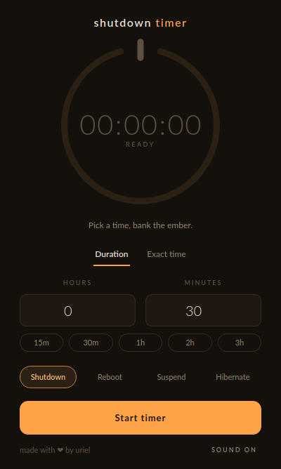
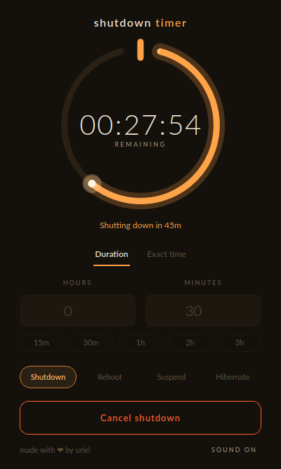
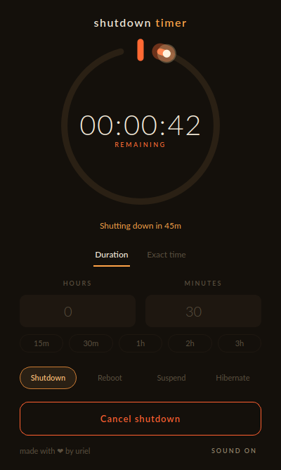

<div align="center">


# Shutdown Timer

**Put your machine to bed.**

A small, warm, beautiful Linux app that powers your computer down on your schedule —
and counts down the minutes like a fading ember.


</div>

---

## The dial

The heart of the app is a hand-painted countdown dial shaped like a power symbol.
Set a timer and the ring drains clockwise, second by second. As the end approaches,
the ember burns hotter — amber fades to coal-red, and the spark rides the ring all
the way down to zero.

<div align="center">
&nbsp;&nbsp;
&nbsp;&nbsp;

</div>

<div align="center">
<sub>Ready &nbsp;·&nbsp; Counting down &nbsp;·&nbsp; Final minute</sub>
</div>

## What it does

- **Four ways to go dark** — shutdown, reboot, suspend, or hibernate. Pick your poison.
- **Two ways to set it** — a duration ("in 2 hours") or an exact clock time ("at 11:30 PM").
- **One-tap presets** — 15m, 30m, 1h, 2h, 3h. Movie night is one click away.
- **Loud when it matters** — desktop notifications at 10, 5, and 1 minute, plus an
  audible tick through the last ten seconds. You will not be surprised by a shutdown.
- **Quiet when it doesn't** — closes to the system tray and keeps counting in the
  background. Mute the sounds with one click.
- **Changed your mind?** — one button cancels everything, instantly.

## Install

Grab the latest `.deb` from the [Releases page](../../releases/latest) and run:

```bash
# VERSION_PLACEHOLDER
sudo apt install ./shutdown-timer_1.0.2_all.deb
```

That's it. Dependencies (`python3`, `python3-pyqt6`, notifications, sound) install
automatically. Launch **Shutdown Timer** from your app menu.

## Run from source

```bash
git clone https://github.com/h200137j/shutdown-timer.git
cd shutdown-timer
pip install -r requirements.txt
python3 main.py
```

## How to use it

1. Pick an action — **Shutdown**, **Reboot**, **Suspend**, or **Hibernate**.
2. Choose **Duration** or **Exact time**, then dial in when it should happen
   (or just smack a preset).
3. Hit **Start timer** and watch the ember burn down.
4. Need to bail? **Cancel** aborts the countdown at any moment.

> **Note:** Shutdown and reboot are scheduled through `shutdown`, which needs `sudo`
> privileges. Suspend and hibernate go through `systemctl` and don't.

## Under the hood

Single-file PyQt6 app. The dial is drawn from scratch with `QPainter` — no images,
no web view, just arcs, gradients, and a spark. Releases are built automatically by
GitHub Actions into a `.deb` on every version tag.

---

<div align="center">
<sub>made with ❤ by uriel</sub>
</div>
